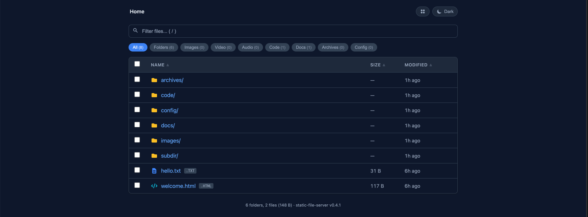

# static-file-server


[](https://opensource.org/licenses/Apache-2.0)
[](https://goreportcard.com/report/github.com/somaz94/static-file-server)


A lightweight, zero-dependency static file server written in Go with a modern directory listing UI.



<br/>

## Features


**Directory Listing UI** — Dark/light mode, grid/list view, file preview (image/video/audio/PDF/code), search with filter chips, batch ZIP download, keyboard navigation. See [UI Guide](docs/ui.md).

**Server Features:**
- Four serving modes (basic / index / listing / both) + [SPA mode](docs/configuration.md#spa-mode)
- Gzip compression (auto-skips binary files and Range requests)
- [CORS & custom headers](docs/cors-and-headers.md) / TLS/HTTPS / access control
- Prometheus metrics (`/metrics`) / JSON logging / `/healthz` health check
- Dot file filtering (`.env`, `.git`, etc.)

<br/>

## Installation

### Prerequisites

- Go 1.26+ (for building from source)
- Docker (optional, for container deployment)
- Kubernetes v1.16+ (optional, for K8s/Helm deployment)

<br/>

### Helm (Recommended)

```bash
helm repo add static-file-server https://somaz94.github.io/static-file-server/helm-repo
helm repo update
helm install my-server static-file-server/static-file-server
```

See [Deployment Guide](docs/deployment.md#kubernetes-helm) for full Helm chart options and storage examples.

<br/>

### Docker

```bash
docker run -d \
  --name static-file-server \
  -p 8080:8080 \
  -v /path/to/files:/web:ro \
  somaz940/static-file-server:v0.4.1
```

<br/>

### Build from Source

```bash
git clone https://github.com/somaz94/static-file-server.git
cd static-file-server
make build
./bin/static-file-server
```

<br/>

### YAML Config File

```bash
cat <<EOF > config.yaml
folder: /var/www
port: 8080
cors: true
show-listing: true
compression: true
hide-dot-files: true
metrics: true
EOF

./bin/static-file-server -c config.yaml
```

See [Configuration Guide](docs/configuration.md) for all options and environment variables.

<br/>

## Quick Start

```bash
# With environment variables
FOLDER=./public PORT=3000 CORS=true ./bin/static-file-server

# With a config file
./bin/static-file-server -c config.yaml
```

<br/>

## Configuration

**Priority:** Environment variables > YAML config file > Default values

| Variable | Type | Default | Description |
|---|---|---|---|
| `FOLDER` | string | `/web` | Root folder to serve |
| `PORT` | uint16 | `8080` | Port number |
| `CORS` | bool | `false` | Enable CORS headers |
| `COMPRESSION` | bool | `false` | Enable gzip compression |
| `SHOW_LISTING` | bool | `true` | Show directory listing |
| `SPA` | bool | `false` | SPA mode: serve `index.html` for non-file routes |
| `METRICS` | bool | `false` | Enable Prometheus metrics at `/metrics` |
| `DEBUG` | bool | `false` | Enable debug logging |
| `HIDE_DOT_FILES` | bool | `false` | Hide dot files from serving and listings |

See [Configuration Guide](docs/configuration.md) for the full variable list (TLS, access control, custom headers, log format, etc.).

<br/>

## Architecture

```
cmd/                    # CLI entry point (Cobra-based)
internal/config/        # Configuration loading (env > YAML > defaults)
internal/handler/       # HTTP middleware chain + directory listing
internal/server/        # HTTP/HTTPS server lifecycle
internal/version/       # Build version metadata (ldflags)
deploy/                 # Kubernetes manifests + Helmfile examples (see [deploy/README.md](deploy/README.md))
helm/                   # Helm chart (7 templates + 7 examples)
docs/                   # Documentation
hack/                   # Build/version scripts
testdata/               # Sample files for local deploy testing
.github/workflows/      # CI/CD (9 workflows)
```

**Middleware chain** (outer to inner): Metrics → Health check → Logging → Prefix → Access key → Referrer → CORS → Custom headers → Compression → Dot files → File handler

<br/>

## Development

```bash
make build            # Build binary
make test             # Run all tests with race detector
make cover            # HTML coverage report
make lint             # Run golangci-lint
make deploy-all       # Build + run + smoke test (47 checks)
make cross-build      # Build for linux/darwin amd64/arm64
```

See [Testing Guide](docs/test.md) for details.

<br/>

## Documentation

| Document | Description |
|----------|-------------|
| [Configuration Guide](docs/configuration.md) | Environment variables, YAML config, serving modes, access control |
| [UI Guide](docs/ui.md) | Directory listing features, keyboard shortcuts, accessibility |
| [Deployment Guide](docs/deployment.md) | Binary, Docker, Kubernetes, Helm (with storage examples) |
| [Deploy Examples](deploy/README.md) | Standalone K8s manifests, Helmfile configuration |
| [CORS & Headers](docs/cors-and-headers.md) | CORS configuration and custom response headers |
| [Testing Guide](docs/test.md) | Unit tests, integration tests, Helm tests, smoke tests |
| [Version Guide](docs/version.md) | Version management, bump process, release workflow |

<br/>

## Contributing

Issues and pull requests are welcome.

<br/>

## License

This project is licensed under the Apache License 2.0 - see the [LICENSE](LICENSE) file for details.
